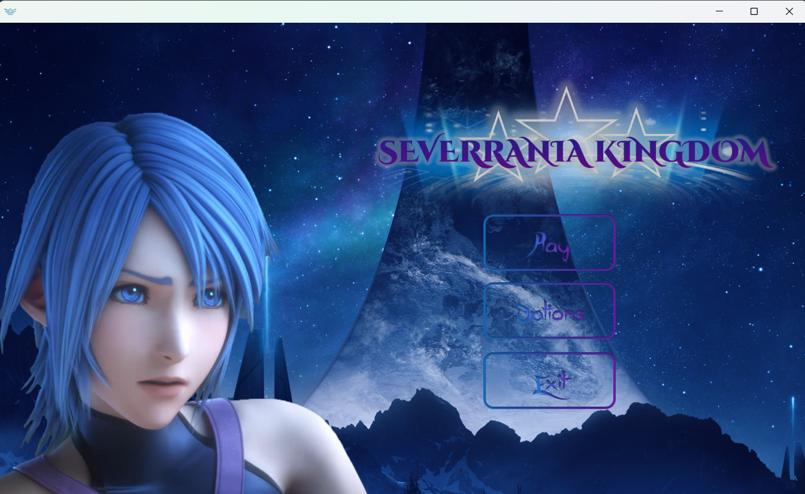
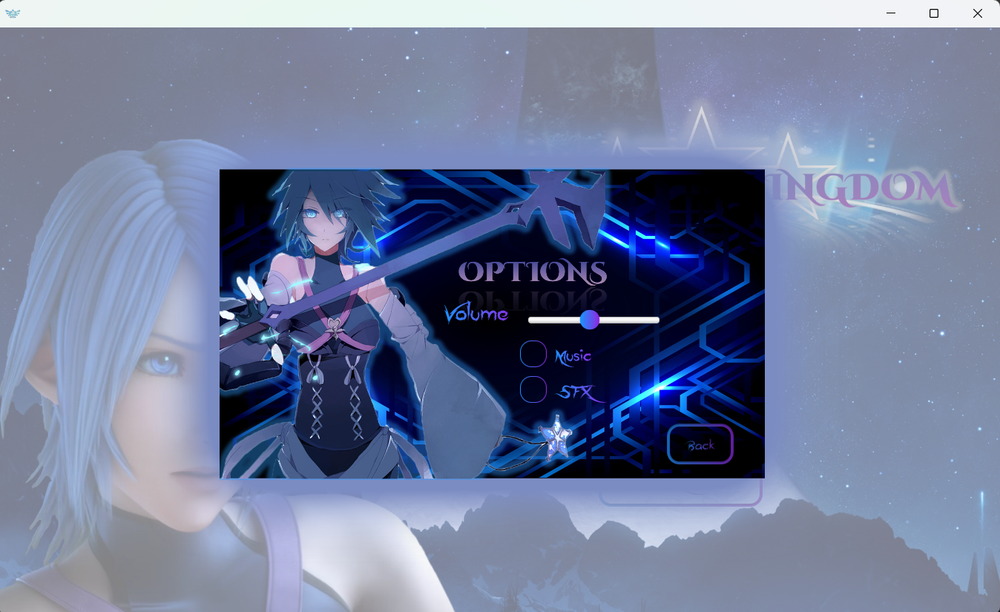
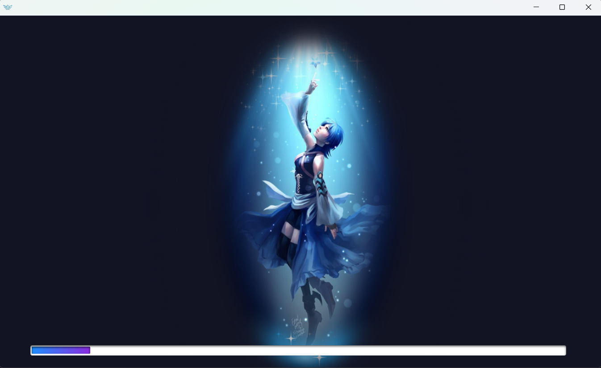
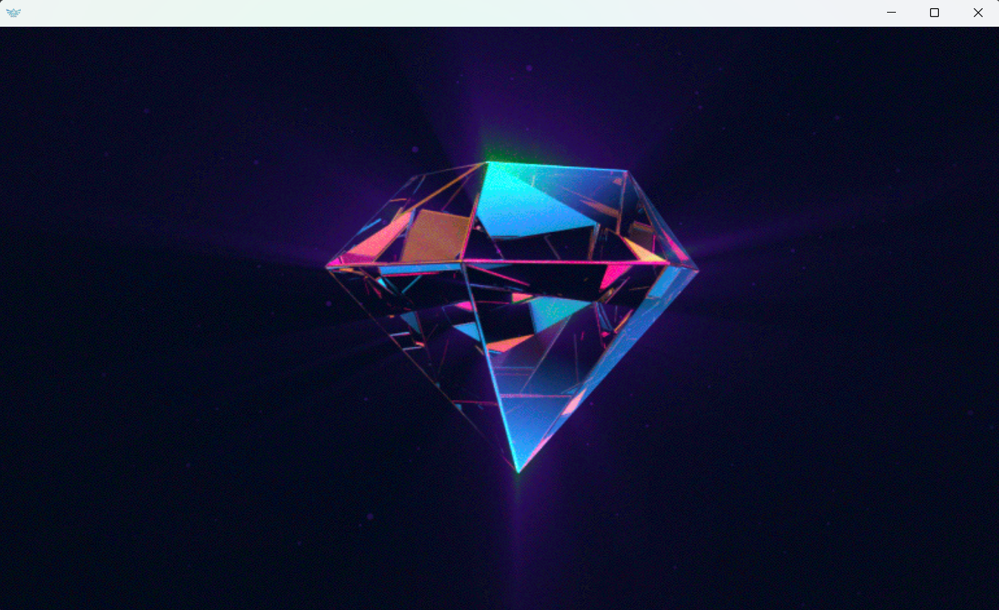
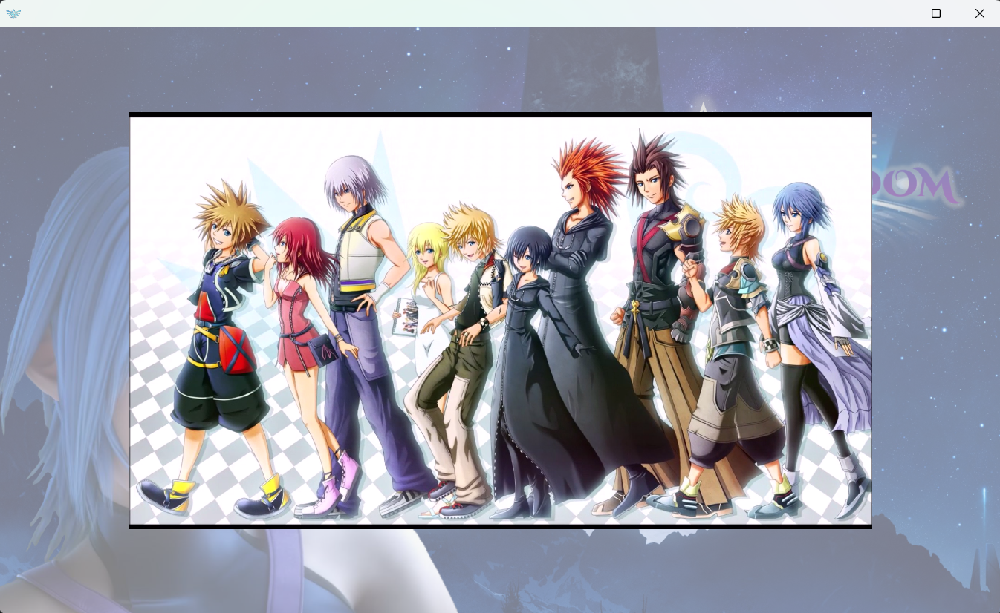
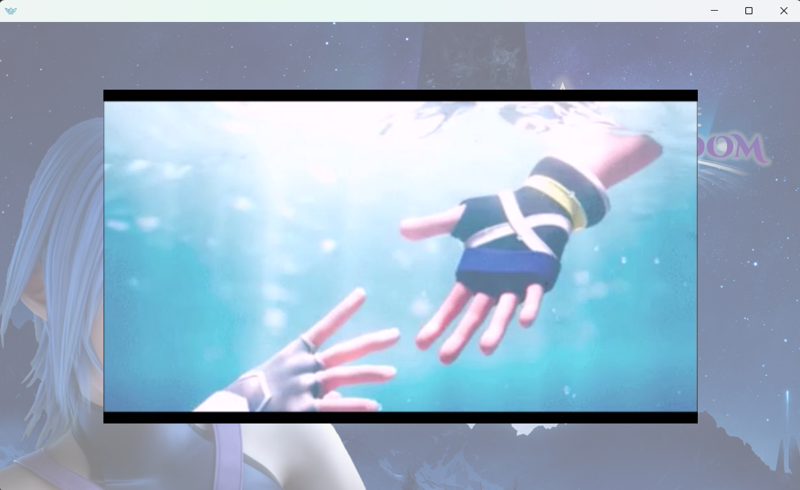
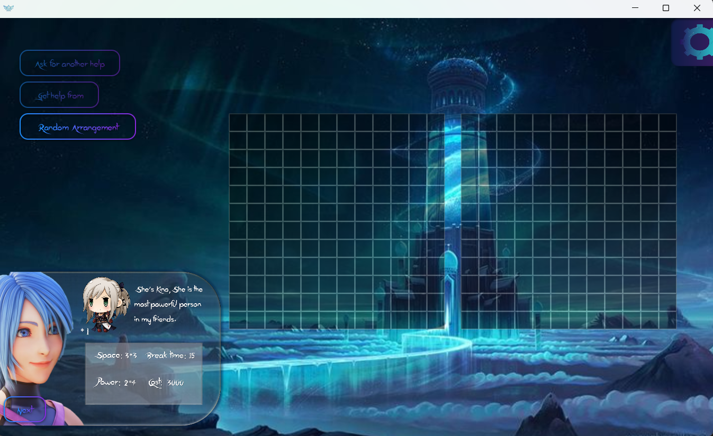
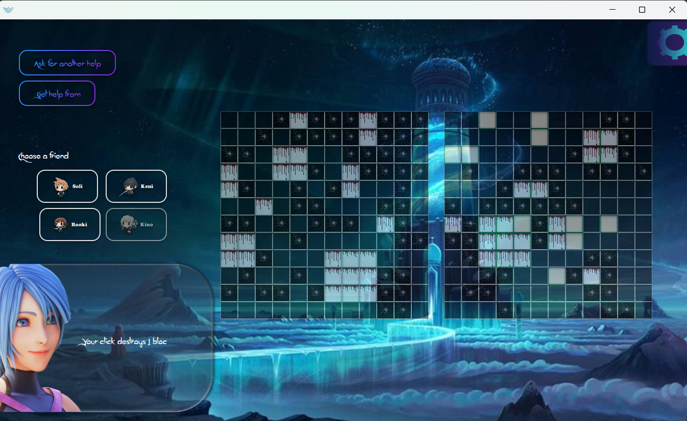
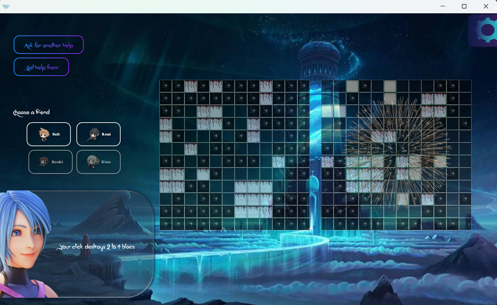

# Severania JavaFx Project

This JavaFX-based game combines elements of Sea Battle with chess-like characters. It was developed as part of my **Advanced Programming Midterm Project**. The game features interactive gameplay with animations, sound effects, and various engaging elements. It includes a game guide, random messages for enhanced user experience, and customization options like purchasing new pieces and random piece arrangement.

## Features

### Core Gameplay
- **Attack Power Modification**: Change the attack power of pieces on the opponent's field.
- **Piece Addition**: Add new pieces to the field during gameplay.
- **AI Opponent**: Compete against an AI-driven opponent, enhancing the challenge.

### Storyline & Customization
- **Storyline & Video**: Immerse yourself in an engaging storyline with a self-made video.
- **Character Creation**: Create unique characters for different pieces, complete with descriptions in the game guide.

### Sound & Animation
- **Sound Customization**: Modify the game's sound effects for a personalized experience.
- **Diverse Animations**: Enjoy various animations that bring the game to life.

### Challenges
- **Challenges with Win Limits**: Set specific challenges with predefined win limits to test your skills.

## UI & Gameplay Enhancements

- **Immersive UI**: The user interface includes vibrant and interactive elements, making the game more engaging.
- **Smooth Transitions & Animations**: JavaFX powers the smooth transitions and variety of animations throughout the gameplay.
- **Story Mode**: Players can enjoy a story-driven mode with a self-produced video that enhances the gaming experience.

## Tech Stack

- **JavaFX**: Used for UI development, animations, and media handling (video and sound).
- **Java**: Core logic implementation and AI for the opponent.
- **FXML**: For creating structured and efficient UI layouts.

## Screenshots
- Menu and Setting
  
<p align="center">
   
   
   
</p>

- Loading

<p align="center">
   
   
</p>

- Story
  
<p align="center">
  
  
</p>

- Game Display and Guide
  
<p align="center">
  
  
  
</p>

## How to Run

1. Clone the repository:
   ```bash
   git clone https://github.com/bitua79/OOP-javafx-midterm-2.git
   ```

2. Open the project in your preferred Java IDE (e.g., IntelliJ, Eclipse) and configure the JavaFX SDK.

3. Run the project to start the game and explore all the new features.

## Acknowledgments
I would like to extend my gratitude to **Dr. Mostafa Nouri Baygi [Webpage](http://prof.um.ac.ir/nouribaygi)** for their guidance and support throughout this project.

## License

This project is licensed under the MIT License - see the [LICENSE](LICENSE) file for details.
